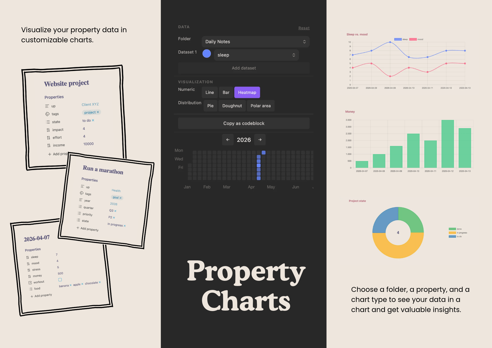
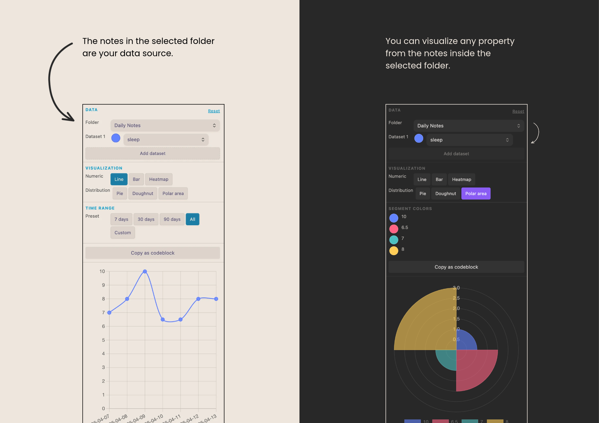
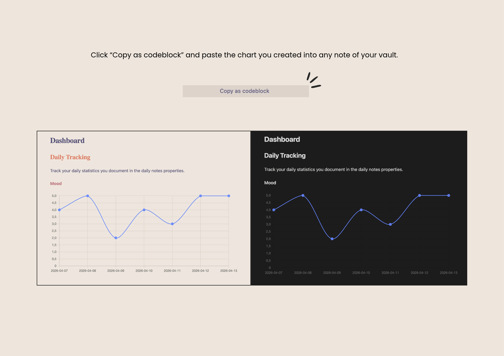
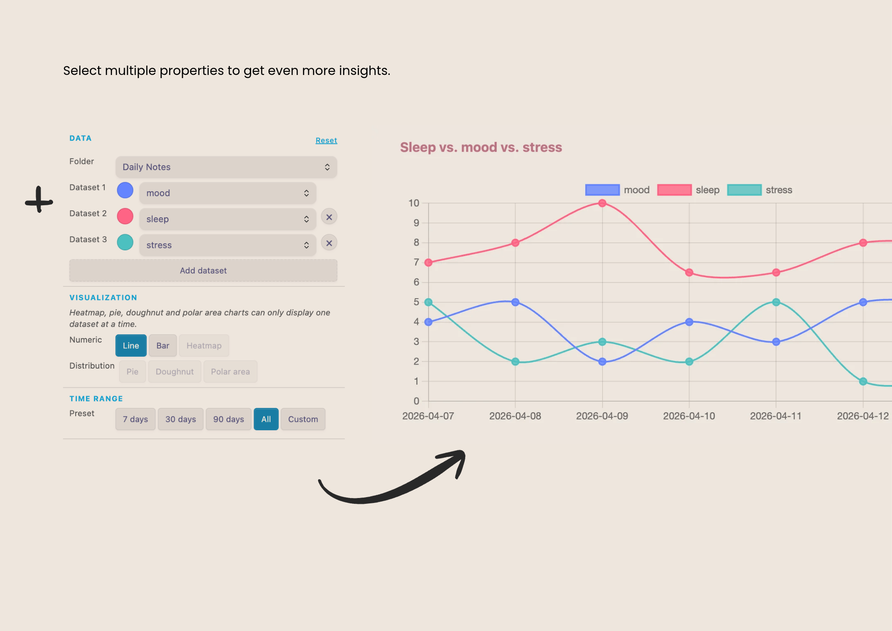
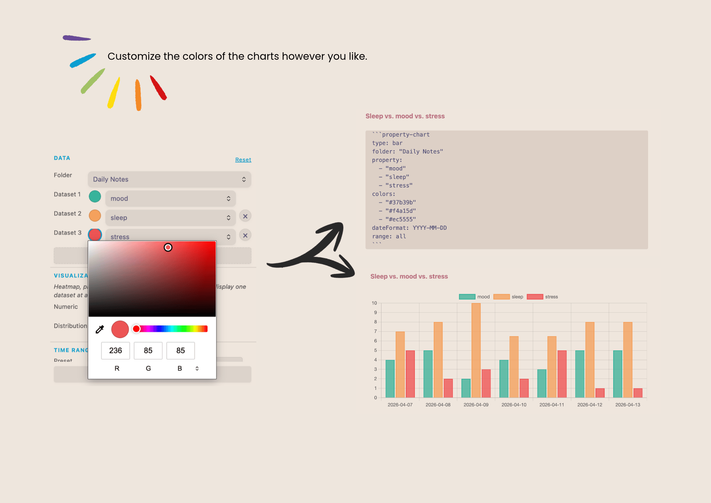

# Property Charts

Visualize properties from your notes as interactive charts — no coding required.



Pick a folder, pick a property, see your data. The interactive sidebar lets you explore and configure charts with dropdowns and buttons. When you're happy with the result, export it as a codeblock to embed it anywhere in your vault.
  
---  

## Getting started

### 1. Open the sidebar

Click the bar chart icon in the ribbon, or run **Property Charts: Open chart view** from the command palette to open the configurator in the sidebar.
### 2. Configure your chart

1. Select a **folder** — all markdown files in that folder become your data source.
2. Select a **property** — any frontmatter key that appears in those files.
3. Pick a **chart type** and **time range**.

The chart updates live as you change settings.


### 3. Embed in a note

Click **Copy as codeblock** to copy the current chart configuration. Paste it into any note:

~~~markdown  
```property-chart  
type: line
folder: "Daily Notes"
property: "mood"
colors: "#6384FF"
dateFormat: YYYY-MM-DD
range: all 
```  
~~~  


  
---  

## Chart types

| Type           | Best for                                       |
| -------------- | ---------------------------------------------- |
| **Line**       | Numeric values over time (mood, sleep, weight) |
| **Bar**        | Comparing values across notes                  |
| **Heatmap**    | Yearly activity overview (GitHub-style)        |
| **Pie**        | Distribution of a single property              |
| **Doughnut**   | Distribution with total count in the center    |
| **Polar area** | Distribution with emphasis on magnitude        |

**Text values are handled automatically.** If a property contains text (e.g. tags, categories), the plugin switches to a frequency chart — no configuration needed.
  
---  

## Multi-dataset comparison

Add multiple datasets to compare several properties side by side in one chart.


  
---  

## Colors

Each dataset gets a color picker in the sidebar. For distribution charts (pie, doughnut, polar area), each segment has its own color. Colors are saved as hex values and included when you copy the configuration as a codeblock.


  
---  

## Codeblock reference

All options for the `property-chart` codeblock:

```yaml  
type: line          # line | bar | heatmap | pie | doughnut | polarArea  
folder: "Journal"   # path to the folder (relative to vault root, or / for root)  
property: mood      # frontmatter key — or a list for multiple datasets:  
# property:  
#   - mood  
#   - energy  
colors: "#6384FF"   # hex color — or a list matching the properties above  
dateFormat: YYYY-MM-DD  # Moment.js format used to parse dates  
range: 30d          # 7d | 30d | 90d | all | YYYY-MM-DD:YYYY-MM-DD  
year: 2026          # heatmap only: which year to display  
```  

**Date resolution:** the plugin looks for a date in this order — frontmatter `date` property, then the filename. Both are parsed with the configured date format.
  
---  

## Settings

| Setting              | Description                                                       |
| -------------------- | ----------------------------------------------------------------- |
| Default folder       | Pre-selected folder when the sidebar opens                        |
| Date format          | Moment.js format for parsing dates from filenames and frontmatter |
| Default chart type   | Chart type selected by default                                    |
| Default time range   | Time range preset selected by default                             |
| File limit per chart | Maximum files processed per chart (0 = no limit)                  |
  
---  

## Support

If Property Charts is useful to you, feedback is very welcome — bug reports, feature ideas, or just a note that it's working well for you.

**Found a bug or have a suggestion?** [Open an issue on GitHub](https://github.com/diana-dcs/property-charts/issues)

**Want to support development or say thank you?** [Buy me a coffee ☕](https://donate.stripe.com/6oUaEX3NrelQe457xy2Ry00)
  
---  

## Data & privacy

All data stays in your vault. The plugin reads frontmatter from your local files and renders charts entirely offline. No network requests are made.
  
---  

## Third-party libraries

- [Chart.js](https://www.chartjs.org/) (MIT) — chart rendering
- [chartjs-chart-matrix](https://github.com/kurkle/chartjs-chart-matrix) (MIT) — heatmap chart type
- [js-yaml](https://github.com/nodeca/js-yaml) (MIT) — codeblock YAML parsing

---  

## License

MIT — see [LICENSE](LICENSE).